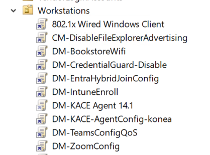
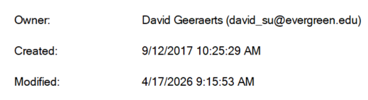
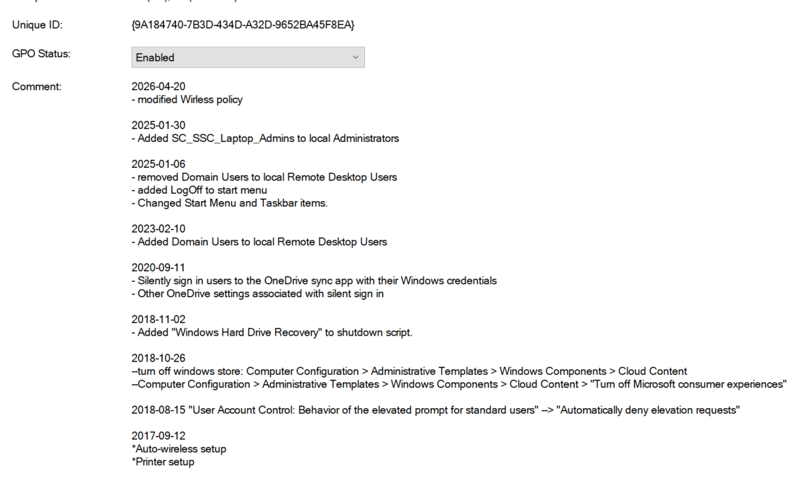

# Active Directory Group Policy

## Summary
This document outlines issues with Group Policy application in our co-shared Active Directory setup, focusing on risks at the root OU level, documentation gaps, and a case study on balancing security with functionality for scientific computing.

## Group Policy Layout

Current group policy setup links GP's at the root of `OU=Workstations`

- Any GP linked at the root of `OU=Workstations` is a "Universal" GP
  - assumes universal settings for all environments
    - Problematic for Scientific Computing
- Universal GP's present a risk of settings "piggybacking"
- "Block inheritance" can mitigate risk, but can be overridden with "Force"

### Resolution
- Treat `OU=Workstations` as a co-shared environment
- Apply GP's at sub-OU level
- Any Universal GP's should go through Change-Control

## Group Policy Documentation (changelog)

- Group Policy timestamp is helpful, but lacks specifics for "version control"
- Advanced troubleshooting requires details on Group Policy settings correlated with time, which a changelog provides

#### Using Group Policy "Comment" as changelog

- at the very least "Universal" GP's should be documented with a brief explanation of what was changed and when.

### Resolution
- Document any changes to a Group Policy 

## Case Study

### Group Policy "DM-CredentialGuard-Disable"

#### Background

Virtualization-Based Security (VBS) is necessary for the ideal setup for WSL2.
WSL2 supports the science curriculum:
- e.g. [SageMath](https://www.sagemath.org/)
- ILC contracts
- Computer Science, but CS is moving to GitHub Codespace. 

#### Conclusion
- Group Policy "DM-CredentialGuard-Disable" got applied as a Universal GP, but "crosses wires" with Scientific Computing.
- In the past, "Credential Guard" [VBS] presented an issue with Evergreen's implementation of 802.1X.
- This is a use case for: "function over security".